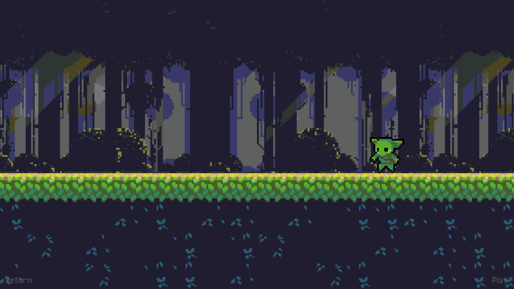
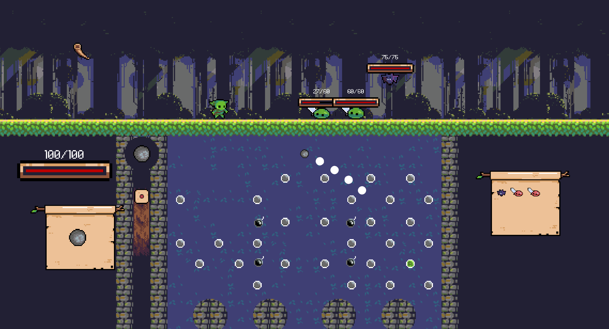

# Peglin



## Overview
**Peglin** is a Unity-based game that combines **peg-based mechanics** with **roguelike combat**.  
Players launch projectiles into a **peggle-style board**, dealing damage to enemies based on the pegs they hit.



---

## Gameplay Features
- **Peg-Based Combat**: Attack enemies by bouncing projectiles off pegs.
- **Turn-Based Strategy**: Plan each shot carefully to maximize damage.
- **Roguelike Progression**: Each run is unique with different encounters.
- **Upgradeable Orbs & Relics**: Enhance your shots and abilities over time.

---

## How to Run the Project

### **Clone the Repository**
```sh
git clone https://github.com/mathieu-portfolio/Peglin.git
```

### **Open in Unity**
- Open **Unity Hub**.
- Click **"Add Project"** and select the folder.
- Open the project in **Unity Editor**.

### **Play the Game**
You can play the release version in `bin/Peglin.exe`
